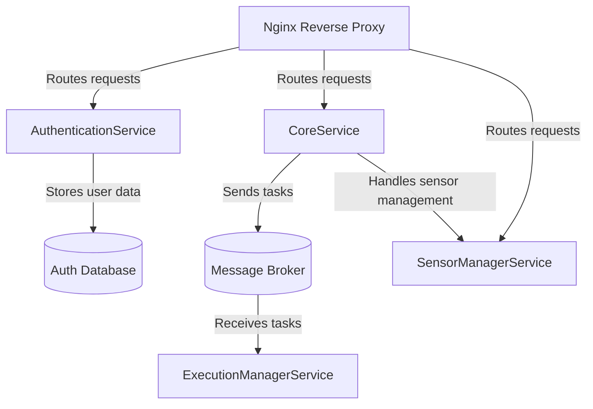

# <p align="center"> 💡 IoT management 💡 </p>
> This is an implementation of platform to management IoT sensors.

## Contents
* [Quick Start](#quick-start)
* [General Info](#general-information)
  * [Frontend Application](#general-information)
  * [Modules](#general-information)
  * [Security](#general-information)
  * [Environment](#general-information)
* [Technologies Used](#technologies-used)
* [Features](#features)
* [Configuration](#Configuration)
* [Testing](#Testing)


## Quick Start
To start the application, execute the following command:
```shell script
docker-compose up
```
*if you are working on windows run in Git Bash first:
```shell script
dos2unix test-env/sql/init_schema.sh
```

## General Information
### 🚀 Frontend Application 🚀
Frontend application is developed on the following repository:  
[https://github.com/rogowski-piotr/iot-management-vue](https://github.com/rogowski-piotr/iot-management-vue)

### 📁 Modules 📁
* [client-api](client-api) - Provide Web API for client applications. Also allow performing CRUD operation
* [model](model) - Shared module containing all application models and database configuration
* [sensor-management](sensor-managment) - Provides executing measurements on sensors
* [sensors](sensors) - Contains documentation and code for each of the available sensors to be configured on the ESP8266 or ESP32 platform
* [test-env](test-env) - Contains documentation and automation scripts to configure continuous integration on Raspberry pi environment

### 🔐 Security 🔐
* Access control to API by providing login and password by [basic authentication](https://en.wikipedia.org/wiki/Basic_access_authentication).
* Security of stored passwords is ensured using [MD55](https://en.wikipedia.org/wiki/MD5) hashing algorithm.

### ▶️ Environment ▶️
Currently, platform runs in the docker layer on the Raspberry pi platform.  
Each sensor based on platform esp8266 or esp32 with support wireless WiFi connection.  
Main platform communicates with sensors using the TCP network protocol.


## Technologies used
* Raspberry Pi
* Docker
* Arduino
* Postgres
* Java 11
  * Spring Boot
  * Spring Security
  * Lombok
  * JPA (Hibernate)
  * JUnit


## Features
- Access to the platform requires authorization.  
- The system use Role-based access control.  
- The platform triggers measurements on sensors, depending on the configuration, it can perform them with different frequency.  
- All communication of the platform with the sensors takes place using the TCP / IP protocol.  
- The platform automatically decides on sensor availability to reduce unnecessary requests.  
- Depending on the configuration, the platform requesting inactive sensors to determine their availability.


## Configuration 
1. Follow [THIS](https://github.com/rogowski-piotr/iot-db-management/blob/master/test-env/README.md) instruction to run application on Raspberry Pi.
2. Follow [THIS](https://github.com/rogowski-piotr/iot-db-management/blob/master/sensors/README.md) to chose and configure sensors IoT.


## Testing
- Manual testing REST API by Postman.  
Prepared collection available: [here](https://www.postman.com/collections/b1f839feccff33a996f7)
- Automatic tests are provided by GitHub actions and a configured CI pipeline for launching JUnit tests using Maven triggered on every push changes.

## Architecture

