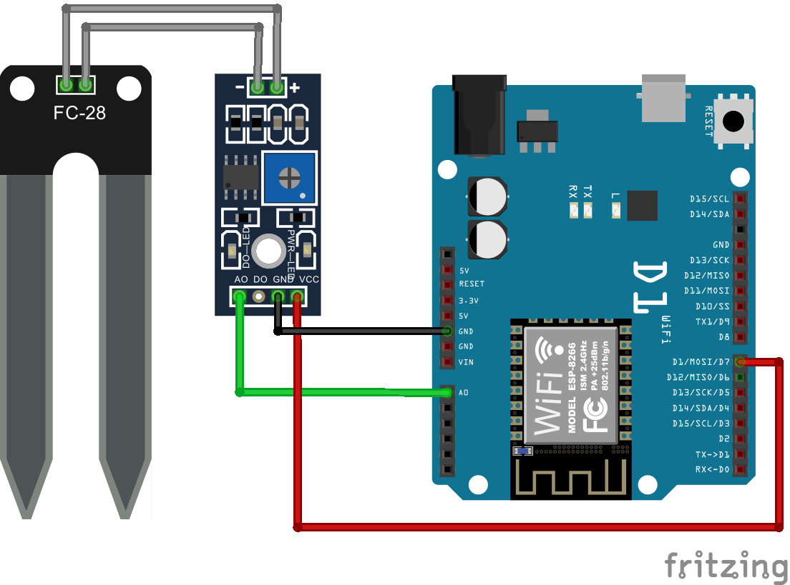

# <p align="center"> 💧🌱 Measurements of soil moisture 💧🌱 </p>
<p align="justify">
    This code allows to measure soil moisture and share data via network using ESP8266 and analog sensor.
    Measurement will be executed every time when any device connects with them by the TCP port.
    The system contains automatic detection of sensor availability in case of a measurement fail.
    After successful measurement, the data will be sent as a response in JSON format.
    If measured value is not included in maximum and minimum acceptable value returned by the sensor the measurement will be marked as an error.
    Included to the response flag 'active' informs about correctness of sensor work.
    <br/>
    Unfortunately this code work only on board ESP8266. ESP32 does not support analog read while having WiFi connection.
    <br/>
    Resolution of ADC is 10 bits.
</p>

<br/>
<br/>

## ✉ Communication ✉
1. Connect on device address and specific TCP port 
2. Handle the response
<br/>
response example:

```json
{
  "sensor": "soil-moisture",
  "active": true,
  "value": 500
}
```

<br/>
<br/>

## ⌨ Software Requirements ⌨
- [Arduino IDE](https://www.arduino.cc/en/Main/software)
- [Arduino ESP8266 library](https://github.com/esp8266/Arduino/tree/master/libraries/ESP8266WiFi)
- [ArduinoJson library v6](https://arduinojson.org/)

<br/>
<br/>

## 💻 Hardware Requirements 💻
- ESP8266
- Soil Moisture Sensor

<br/>
<br/>

## ✨ Setup ✨
1. Setup all components like on below diagram
<p align="center">
  
</p>
2. Provide all credentials to connect local network by changing this part:

```cpp
#define SSID "ssid_name"
#define PASSWORD "secret"
```
3. Specify the minimum and maximum accepted value by changing this part:

```cpp
#define MAXIMUM_ACCEPTABLE_VALUE 1020
#define MINIMUM_ACCEPTABLE_VALUE 100
```