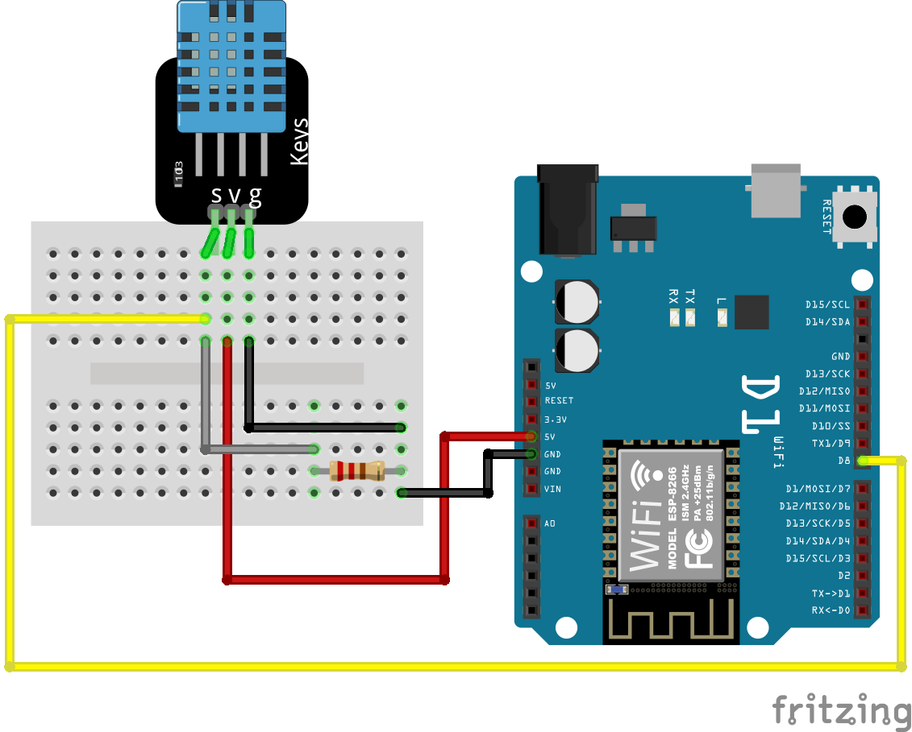

# <p align="center"> 💧🌡 Measurements of temperature and humidity 💧🌡 </p>
<p align="justify">
This code allows to measure temperature and humidity and share data via network using ESP8266 and DHT11 sensor.
Measurement will be executed every time when any device connects with them by the TCP port.
After successful measurement, the data will be sent as a response in JSON format.
The system contains automatic detection of sensor availability in case of a measurement fail.
Included to the response flag 'active' informs about correctness of sensor work.
</p>

<br/>
<br/>

## ✉ Communication ✉
1. Connect on device address and specific TCP port 
2. Handle the response
response example:
```json
{
  "sensor": "DHT11",
  "active": true,
  "temperature": 25.5,
  "humidity": 50
}
```

<br/>
<br/>

## ⌨ Software Requirements ⌨
- [Arduino IDE](https://www.arduino.cc/en/Main/software)
- [Arduino ESP8266 library](https://github.com/esp8266/Arduino/tree/master/libraries/ESP8266WiFi)
- [ArduinoJson library v6](https://arduinojson.org/)

<br/>
<br/>

## 💻 Hardware Requirements 💻
- ESP8266
- Sensor DHT11

<br/>
<br/>

## ✨ Setup ✨
1. Setup all components like on below diagram
<p align="center">
  
</p>
2. Connect to local network by changing this part of the code:

```cpp
const char* ssid = " **here ";
const char* password = " **here";
```